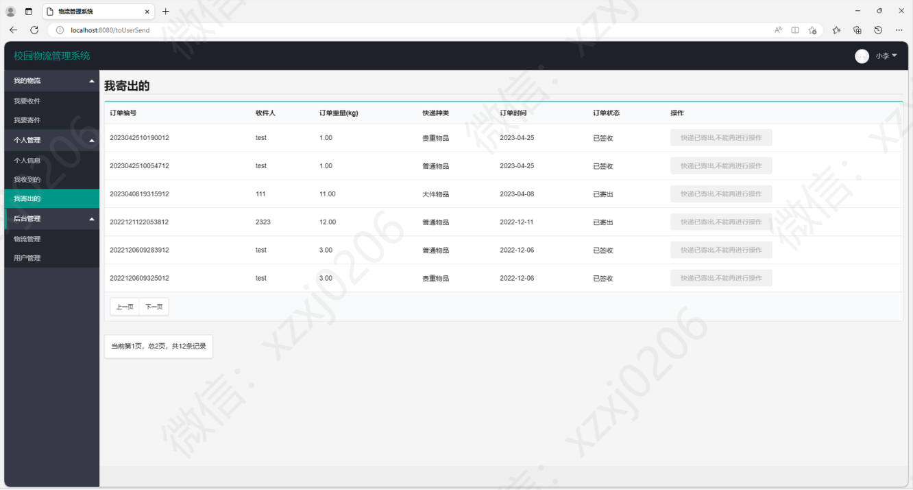

# 校园快递管理系统

### 有问题，或者需要协助调试运行项目的, 可以加QQ：2529519551，或者微信 ：xzxj0206 注明项目，“git+项目名称” ，如：“git学生宿舍管理系统”

### 更多项目： https://github.com/34426?tab=repositories

## 一、系统运行界面

基于springboot的校园快递管理系统

## 二、项目介绍

基于springboot的校园快递管理系统

项目技术

SpringBoot+MybatisPlus+Thymeleaf+jquery+layui

主要功能
我的物流
我要收件
我要寄件
个人管理
个人信息
我收到的
我寄出的
后台管理
物流管理
用户管理

## 三、系统部分功能页面截图

### 1、用户模块部分功能页面截图

### 管理员模块部分功能页面截图

